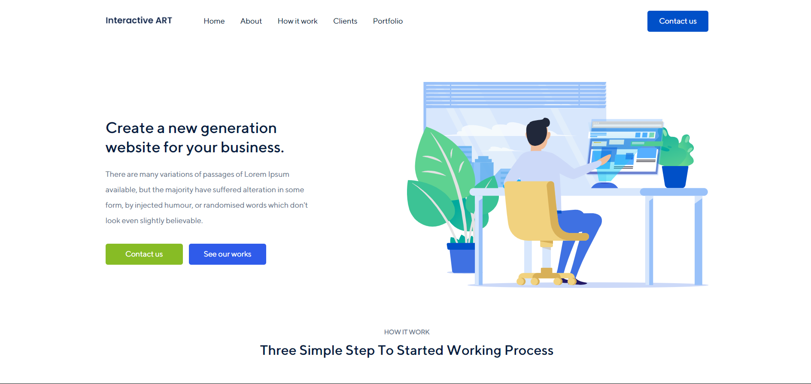

<h1 align="center"> Work Introduction Website 💼 </h1>

---
### This project written used by HTML, CSS and Javascript.
### Main project by https://sabzlearn.ir
### Run the program with live-server on `index.html`
### See demo on [This URL](https://devmasen.github.io/learning-flex-box/)
### There is design Adobe XD file for you in Interactivereart.xd
### I used CSS flex-box layout to write some examples and projects.
### You can use this repo as a resource for learning this powerful CSS layout
### You can find learning concenpts in learning-files directory
